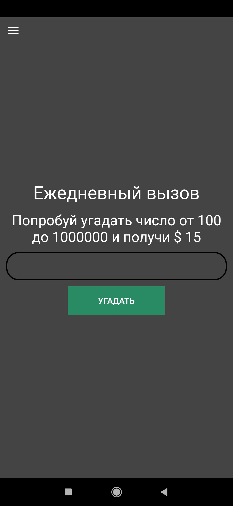

# Numbers_Project

Application idea:
1) Handbook of mathematics and algorithms
2) A tool for quickly calculating the properties of a number
3) If the application is downloaded to the PlayMarket, then people can check their luck every day by participating in the lottery for guessing the numbers

## Main Screen

## Properties of the entered number

## Math handbook

## Algorithms handbook

## Lottery screen

## Menu

# Further improvements:
1) Supplementing both directories
2) Automation of lottery winners
3) Adding content (both to the property calculator itself and to both handbooks) for which people would not mind paying
4) Code cleaning
5) Adding comments
